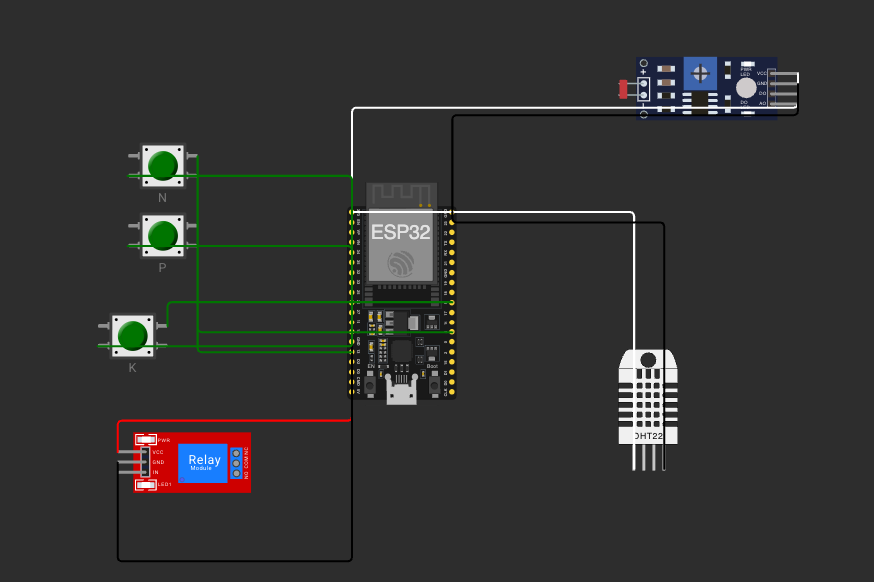

# FarmTech Solutions — Fase 2
## Sistema de Irrigação Inteligente com ESP32 e Integração Meteorológica

Projeto acadêmico desenvolvido para a disciplina de IoT/Agricultura Digital da FIAP, dando continuidade à **Fase 1**, na qual foi implementado em Python o cálculo de área plantada e monitoramento climático para as culturas de **soja** e **milho**.

Nesta Fase 2, construímos um **dispositivo eletrônico simulado no Wokwi** que monitora em tempo real as condições do solo e decide automaticamente quando acionar a bomba de irrigação — levando em conta, também, a **previsão de chuva obtida via API pública (OpenWeather)** integrada em Python.

---

## 📑 Sumário

- [Objetivo](#objetivo)
- [Cultura escolhida: Soja](#cultura-escolhida-soja)
- [Componentes e sensores](#componentes-e-sensores)
- [Circuito e mapeamento de pinos](#circuito-e-mapeamento-de-pinos)
- [Lógica de decisão da irrigação](#lógica-de-decisão-da-irrigação)
- [Integração Python ↔ ESP32 (Ir Além – Opcional 1)](#integração-python--esp32-ir-além--opcional-1)
- [Estrutura do repositório](#estrutura-do-repositório)
- [Como executar](#como-executar)
- [Imagens do circuito](#imagens-do-circuito)
- [Vídeo de demonstração](#vídeo-de-demonstração)
- [Equipe](#equipe)

---

## Objetivo

Desenvolver um **sistema de irrigação automatizado e inteligente** que:

1. Monitore em tempo real os níveis dos nutrientes **N (Nitrogênio)**, **P (Fósforo)** e **K (Potássio)**, o **pH** e a **umidade do solo**.
2. Decida, com base nessas leituras, se deve **ligar ou desligar a bomba d'água** (representada por um relé).
3. Consulte a **previsão de chuva** para a região da lavoura e **suspenda a irrigação automaticamente** quando houver chuva prevista, economizando água.

---

## Cultura escolhida: Soja

A **soja (*Glycine max*)** é uma das culturas mais representativas do agronegócio brasileiro e uma das mais plantadas no Rio Grande do Sul, região da nossa simulação.

Parâmetros agronômicos adotados como referência na lógica de irrigação:

| Parâmetro | Faixa ideal para soja | Observação |
|---|---|---|
| **pH do solo** | 5,5 a 7,0 (ótimo entre 6,0 e 6,8) | Fora dessa faixa há bloqueio na absorção de nutrientes. |
| **Umidade do solo** | 60% a 80% | Abaixo de 60% indica necessidade de irrigação. |
| **Nitrogênio (N)** | Menos crítico | A soja é leguminosa e **fixa N do ar** via bactérias *Rhizobium*. |
| **Fósforo (P)** | Crítico | Essencial para desenvolvimento radicular e enchimento dos grãos. |
| **Potássio (K)** | Crítico | Regula trocas hídricas e resistência a estresses. |

Essa caracterização biológica da soja é levada em conta na lógica da bomba: **a ausência de N, por si só, não impede a irrigação**, já que a planta supre parte dessa necessidade naturalmente.

---

## Componentes e sensores

Como o Wokwi não dispõe de sensores agrícolas reais, foram feitas **substituições didáticas** conforme orientação do enunciado:

| Grandeza real | Sensor/componente usado | Comportamento no projeto |
|---|---|---|
| Nível de Nitrogênio (N) | **Botão verde** | Pressionado = presente (`true`); Solto = ausente (`false`) |
| Nível de Fósforo (P) | **Botão verde** | Pressionado = presente (`true`); Solto = ausente (`false`) |
| Nível de Potássio (K) | **Botão verde** | Pressionado = presente (`true`); Solto = ausente (`false`) |
| pH do solo | **Sensor LDR** (analógico) | Valor analógico convertido para escala de pH (0–14) |
| Umidade do solo | **Sensor DHT22** | Usamos o valor de umidade do ar como substituto didático |
| Bomba d'água | **Módulo Relé azul** | Ligado = irrigando; Desligado = parada |

> 💡 **Observação sobre o LDR**: o sensor retorna um valor analógico de 0 a 4095 (resolução do ADC do ESP32). No código, esse valor é mapeado linearmente para a escala de pH 0–14, de modo que **mais luz sobre o LDR representa pH mais ácido ou mais básico** (a convenção adotada está documentada no próprio código).

---

## Circuito e mapeamento de pinos

| Componente | Pino ESP32 | Modo | Observação |
|---|---|---|---|
| Botão N (verde) | **GPIO 15** | `INPUT_PULLUP` | Lógica invertida (LOW = pressionado) |
| Botão P (verde) | **GPIO 4** | `INPUT_PULLUP` | Lógica invertida |
| Botão K (verde) | **GPIO 5** | `INPUT_PULLUP` | Lógica invertida |
| LDR (pH) | **GPIO 34** | `INPUT` (ADC) | Leitura analógica 0–4095 |
| DHT22 (umidade) | **GPIO 18** | Digital | Biblioteca DHT |
| Relé (bomba) | **GPIO 19** | `OUTPUT` | HIGH = bomba ligada |

---

## Lógica de decisão da irrigação

A decisão de ligar ou desligar a bomba é tomada a cada ciclo do `loop()` com base em **cinco condições combinadas**:

### Regra de ativação (bomba LIGADA)

A bomba é acionada quando **todas** as condições abaixo são verdadeiras:

1. ✅ **Umidade do solo < 60%** — o solo está seco
2. ✅ **pH entre 5,5 e 7,0** — condição química aceitável para soja
3. ✅ **Pelo menos P ou K presente** (botões pressionados) — há nutrientes críticos disponíveis para absorção
4. ✅ **Sem previsão de chuva** nas próximas horas (informação vinda do Python via Serial)

### Regra de desativação (bomba DESLIGADA)

A bomba é desligada quando **qualquer uma** das condições abaixo ocorre:

- ❌ Umidade do solo ≥ 70% (já irrigado suficientemente — histerese para evitar liga-desliga)
- ❌ Previsão de chuva recebida do Python (economia de água)
- ❌ pH fora da faixa 5,5–7,0 (gera um **alerta no Serial** recomendando correção do solo antes de irrigar)

### Fluxograma resumido

```
        ┌────────────────────────┐
        │ Ler N, P, K, pH, umid. │
        └───────────┬────────────┘
                    ▼
        ┌────────────────────────┐
        │ Chuva prevista? (API)  │──► SIM ──► DESLIGA bomba
        └───────────┬────────────┘
                    │ NÃO
                    ▼
        ┌────────────────────────┐
        │ pH entre 5.5 e 7.0?    │──► NÃO ──► ALERTA + desliga
        └───────────┬────────────┘
                    │ SIM
                    ▼
        ┌────────────────────────┐
        │ Umidade < 60%?         │──► NÃO ──► DESLIGA bomba
        └───────────┬────────────┘
                    │ SIM
                    ▼
        ┌────────────────────────┐
        │ P ou K pressionado?    │──► NÃO ──► DESLIGA bomba
        └───────────┬────────────┘
                    │ SIM
                    ▼
              LIGA BOMBA
```

A histerese (liga com umidade < 60%, desliga com umidade ≥ 70%) evita que a bomba fique oscilando perto do limite, o que seria ineficiente e pouco realista em um cenário de lavoura.

---

## Integração Python ↔ ESP32 (Ir Além – Opcional 1)

Foi implementada a integração com a **API pública OpenWeather** para consultar a previsão do tempo na região da lavoura simulada (Ijuí/RS).

### Como funciona

1. O script `python/previsao_chuva.py` faz uma requisição à OpenWeather (endpoint `/data/2.5/forecast`).
2. O script analisa as próximas horas do retorno e identifica se há previsão de **chuva** (códigos `Rain`, `Drizzle` ou `Thunderstorm`).
3. O script imprime no terminal uma instrução clara do valor a ser digitado no **Monitor Serial do Wokwi**:
   - `1` → há previsão de chuva (o ESP32 irá suspender a irrigação)
   - `0` → sem previsão de chuva (irrigação autorizada)
4. No lado do ESP32, as funções `Serial.available()` e `Serial.read()` capturam esse caractere e atualizam a variável `chuva_prevista`, que entra na lógica de decisão da bomba.

### Por que essa abordagem?

O Wokwi em seu plano gratuito **não permite conexão direta** entre o terminal Python local e o Monitor Serial simulado. A solução aqui adotada — **Python roda a consulta, humano atua como ponte para o Serial** — atende ao requisito do enunciado de usar `Serial.available()` e `Serial.read()`, além de ser defensável e realista.

---

## Estrutura do repositório

```
fase2-farmtech/
├── README.md                       ← este arquivo
├── src/
│   └── irrigacao_esp32.ino         ← código C++ para ESP32
├── python/
│   ├── previsao_chuva.py           ← script de consulta OpenWeather
│   └── requirements.txt            ← dependências (requests)
├── assets/
│   ├── circuito_wokwi.png          ← imagem do circuito montado
│   └── simulacao_rodando.png       ← imagem da simulação em execução
└── docs/
    └── logica_irrigacao.md         ← detalhamento adicional da lógica (opcional)
```

---

## Como executar

### 1. Simulação no Wokwi

1. Acesse [wokwi.com](https://wokwi.com) e crie um novo projeto para ESP32.
2. Copie o conteúdo de `src/irrigacao_esp32.ino` para o editor do Wokwi.
3. Monte o circuito conforme a [tabela de pinos](#circuito-e-mapeamento-de-pinos) acima.
4. Clique em **Start Simulation**.
5. Abra o **Monitor Serial** para acompanhar as leituras dos sensores e os alertas.

### 2. Script Python (previsão de chuva)

**Pré-requisitos:**
- Python 3.8+
- Chave gratuita da [OpenWeather API].

**Passos:**

```bash
# Entrar na pasta do script
cd python

# Instalar dependências
pip install -r requirements.txt

# Executar (substitua SUA_CHAVE pela API key da OpenWeather)
export OPENWEATHER_API_KEY="SUA_CHAVE"
python previsao_chuva.py
```

O script imprimirá algo como:

```
🌦️  Previsão para Ijuí/RS nas próximas 6 horas:
     - Chuva detectada: SIM (Rain, 14:00)
     - Digite "1" no Monitor Serial do Wokwi para suspender a irrigação.
```

Ou, sem chuva:

```
☀️  Previsão para Ijuí/RS nas próximas 6 horas:
     - Sem chuva prevista.
     - Digite "0" no Monitor Serial do Wokwi (irrigação autorizada).
```

### 3. Enviando o dado ao ESP32

Com a simulação Wokwi aberta, **clique na caixa do Monitor Serial** e digite `1` ou `0` conforme a saída do Python. A bomba (relé) reagirá conforme a nova informação.

---

## Imagens do circuito

> 📸 As imagens abaixo demonstram as conexões dos sensores solicitados:



---

## Vídeo de demonstração

🎥 **Vídeo no YouTube (até 5 min, não listado): https://youtu.be/pMzDIXv-jOE **

O vídeo demonstra:
1. Apresentação do grupo e da cultura escolhida (soja).
2. Circuito no Wokwi e explicação das substituições didáticas.
3. Simulação com variação dos botões NPK, LDR e DHT22 — bomba ligando e desligando conforme a lógica.
4. Execução do script Python com consulta à API OpenWeather.
5. Entrada manual do dado via Monitor Serial e reação do sistema à previsão de chuva.

---

## Equipe

| Nome | RM |
|---|---|
| *Guilherme Avila* | *mr571294* |
| *Kainan Bilibio* | *rm570594* |


---

## Referências

- Enunciado oficial da Fase 2 — FIAP / FarmTech Solutions.
- EMBRAPA — *Tecnologias de Produção de Soja*. Disponível em: https://www.embrapa.br/soja
- Documentação oficial do ESP32 — Espressif Systems.
- OpenWeather API — https://openweathermap.org/api
- Documentação do DHT22 e LDR no simulador Wokwi — https://docs.wokwi.com